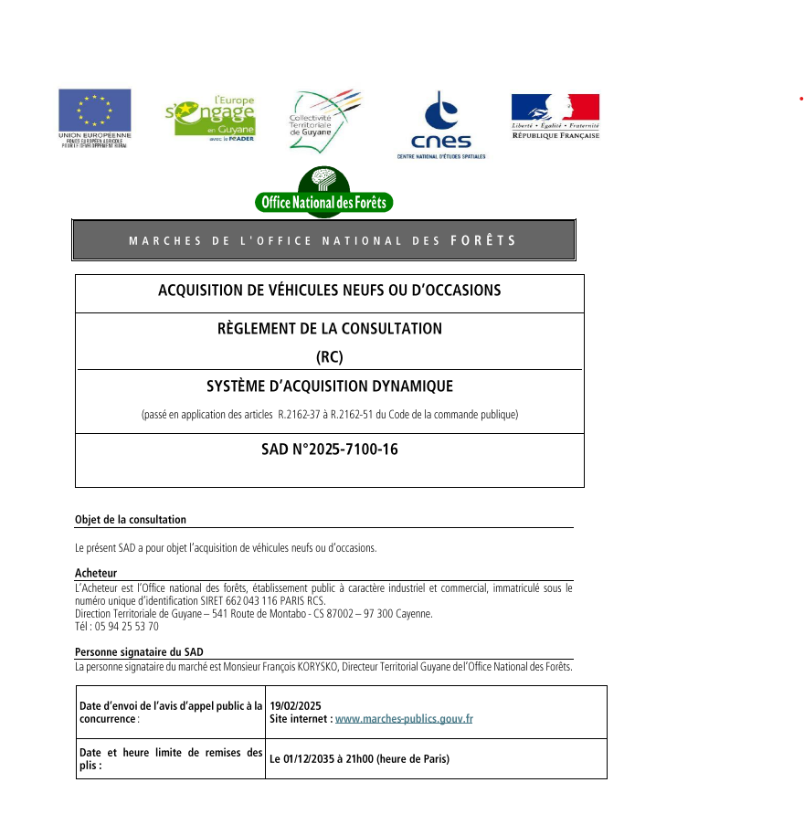
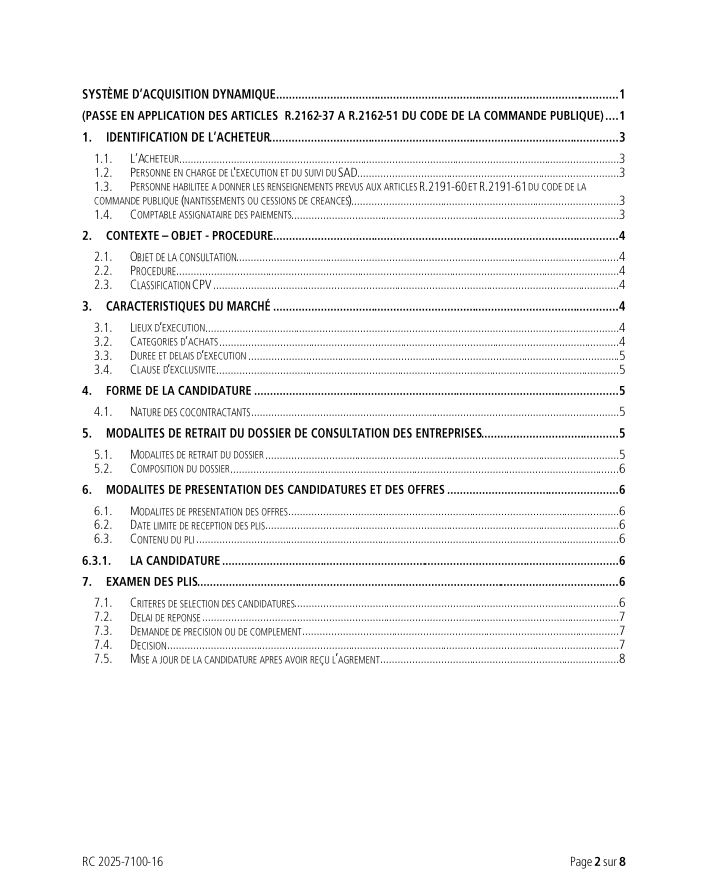
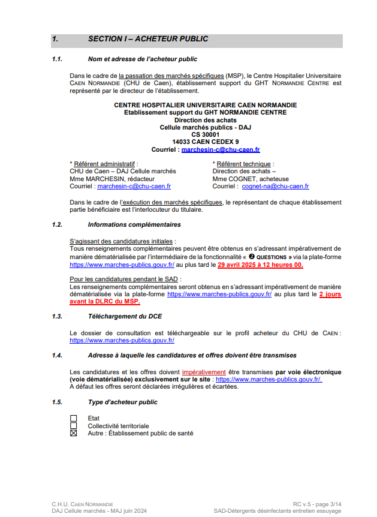
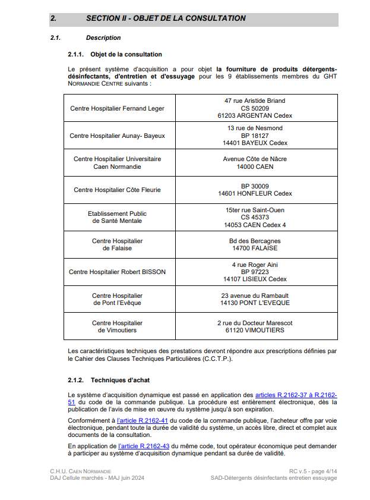

Data acquisition
======
Data description
----------------
The data used in the Textra Tenders project consists of tenders from various businesses that publish calls for bids. This data includes details such as:

Tender ID
Company/Organization name
Tender description
Submission deadlines
Tender requirements
Contact information
Categories (e.g., construction, IT, consulting)
Location and region of the tender
Published date
The dataset provides critical information for both suppliers and companies. Suppliers can search, review, and respond to these tenders through the system, while companies can manage and evaluate responses.

Data Source:
----------------

Some platforms offer open access to tenders, while others require registration or subscription for detailed information. Tenders can be accessed through web scraping or APIs, depending on the platform, but access may be restricted by platform policies. A major challenge is the inability to bulk download tenders; each must be downloaded individually due to platform limitations.

Snippets of tender documents:
----------------

