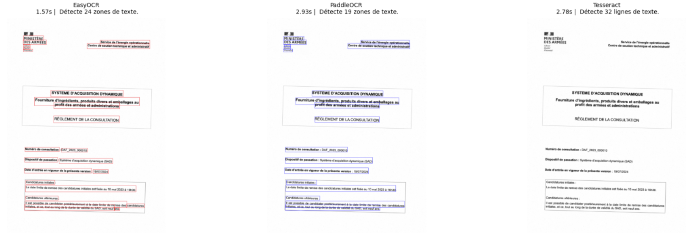
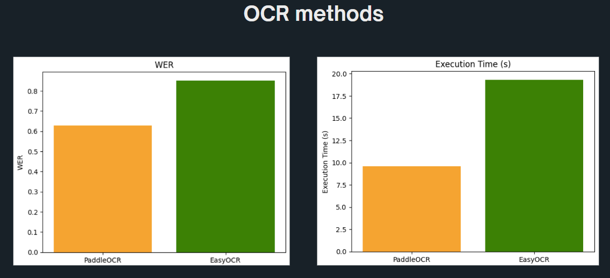
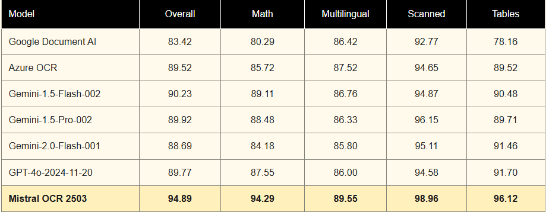

Information Extraction 
======

In our project, we will proceed for information Extraction by using Mistral, PaddleOCR, and PyPDF2

- **Mistral** for advanced natural language processing (NLP).
- **PaddleOCR** for Optical Character Recognition (OCR).
- **PyPDF2** for parsing and extracting text from standard PDFs.

Pipeline Workflow
----------------

**1. File Processing**
The system detects the file type and applies the appropriate method for text extraction:

- **PDFs**: Processed using **PyPDF2** for text-based PDFs or **PaddleOCR** for scanned ones.

- **Images**: Directly processed using **PaddleOCR**.

**2. Text Extraction**

Here is a quick tutorial on how to proceed with the text extraction:

.. raw:: html

   

Benchmarking:
----------------
We will benchmark the performance of the OCR and NLP components using a set of predefined metrics, such as:
- **Accuracy**: The percentage of correctly extracted information.      
- **Speed**: The time taken to process each document.
- **Scalability**: The ability to handle increasing volumes of documents without performance degradation.
- **Error Rate**: The frequency of errors in the extracted data.
- **Resource Utilization**: The computational resources used during processing.

Let's start with an exaple showing the amount of time taken to extract text from a given image as well as the amount of data extrracted, using PaddleOCR, EasyOCR, and Tesseract OCR.

Now let's compare OCR methods in terms of WER and exection time. 

Mistral OCR:
----------------
Mistral OCR is a premium document understanding solution from Mistral AI that goes beyond standard OCR by accurately extracting and structuring content from complex documents, including tables, LaTeX, and multilingual text.

It supports high-speed processing (up to 2,000 pages/min), outputs structured formats like JSON and Markdown, and integrates with RAG systems. It is ideal for use in legal, academic, and enterprise contexts, with both cloud and on-premise deployment options.

Mistral OCR is particularly useful for extracting structured data from complex documents, such as tenders, where precise information extraction is crucial. It can handle various formats and languages, making it versatile for different business needs.

Here is a demo of Mistral OCR in action, showcasing its capabilities in extracting structured data from complex documents:

.. raw:: html

    

        <iframe src="https://youtu.be/YOJDAkgLn80?si=75aeyy5QRYa2bguS" frameborder="0" allowfullscreen style="position: absolute; top: 0; left: 0; width: 100%; height: 100%;"></iframe>
    

.. note:: 

   - Mistral OCR is a paid service, and you can find more information about it on the `Mistral OCR website <https://mistral.ai/ocr/>`_.

This table summarizes the key PERFORMANCES of Mistral OCR with different models:

